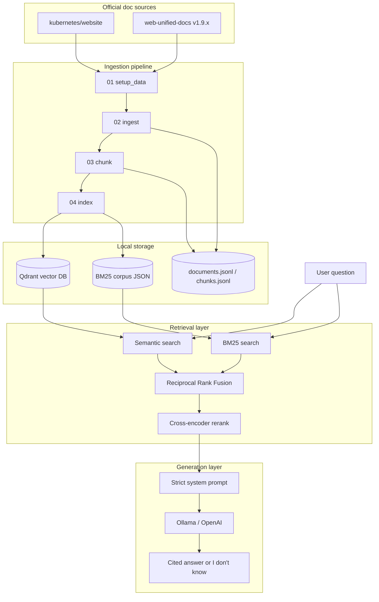
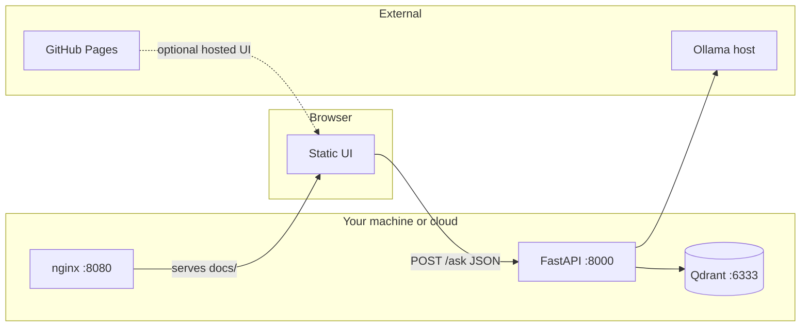

# Architecture

System design for the DevOps Knowledge Copilot RAG pipeline.

---

## End-to-end flow



---

## Retrieval modes (ablation)

| Mode | Semantic | BM25 | RRF | Reranker |
|------|----------|------|-----|----------|
| `semantic_only` | Yes | No | No | No |
| `hybrid_no_rerank` | Yes | Yes | Yes | No |
| `full` | Yes | Yes | Yes | Yes |

Configured via `--mode` on CLI scripts or `retrieval_mode` in the RAG pipeline.

---

## Module map

```
src/
├── config.py                 # settings.yaml loader
├── models.py                 # Document, Chunk, SearchHit, SourceCitation
├── ingest/
│   ├── setup.py              # Git sparse clone
│   └── parser.py             # Markdown/MDX → JSONL
├── chunking/
│   └── splitter.py           # Header-aware chunks
├── indexing/
│   ├── embedder.py           # sentence-transformers
│   ├── vector_store.py       # Qdrant client
│   └── keyword_index.py      # BM25
├── retrieval/
│   ├── fusion.py             # Reciprocal Rank Fusion
│   ├── reranker.py           # cross-encoder
│   └── pipeline.py           # Retriever (search + modes)
├── generation/
│   ├── prompt.py             # System prompt template
│   ├── answer.py             # Generate from retrieved chunks
│   └── llm.py                # Ollama / OpenAI client
├── rag/
│   └── pipeline.py           # Retrieve + generate
├── api/
│   ├── main.py               # FastAPI app
│   ├── routes.py             # /health, /ask
│   └── schemas.py            # Request/response models
└── evaluation/
    ├── loader.py             # Load/save eval JSON
    └── ragas_runner.py       # RAGAS metrics
```

---

## Data flow per question

1. **Query** enters the retriever
2. **Semantic branch:** embed query → Qdrant top-20
3. **Keyword branch:** BM25 top-20
4. **RRF** merges ranked lists (k=60)
5. **Reranker** scores top-20 → final top-5 chunks
6. **Prompt** injects chunks with title, section, URL
7. **LLM** generates answer following strict rules
8. **Response** includes answer + `SourceCitation` list

---

## Configuration

All tunables in `config/settings.yaml`:

| Section | Controls |
|---------|----------|
| `paths` | File locations for data and eval |
| `doc_sources` | Git repos, globs, public URL bases |
| `chunking` | Word targets, overlap, min section size |
| `embeddings` | Model name, batch size |
| `reranker` | Cross-encoder model, top-k before/after |
| `qdrant` | Host, port, collection name |
| `retrieval` | Semantic/keyword top-k, RRF k |
| `generation` | Provider (ollama/openai), model, temperature |

Environment variables override YAML — see `src/config.py` and `.env.example`.

---

## Deployment architecture (industry standard)



| Component | Dev | Production (target) |
|-----------|-----|---------------------|
| UI | `docker compose` nginx :8080 | GitHub Pages |
| API | Docker or `uvicorn --reload` | Render / Railway (HTTPS) |
| Qdrant | Docker volume | Qdrant Cloud |
| LLM | Ollama on host | OpenAI / hosted GPU |

Runbook → [OPERATIONS.md](OPERATIONS.md)

---

## Infrastructure (Docker Compose)

| Service | Image | Port | Purpose |
|---------|-------|------|---------|
| `qdrant` | `qdrant/qdrant:v1.13.2` | 6333 | Vector storage |
| `api` | Built from `docker/Dockerfile.api` | 8000 | FastAPI backend |
| `ui` | `nginx:alpine` | 8080 | Serves `docs/` static frontend |

```powershell
docker compose up -d
```

Environment overrides: `QDRANT_HOST`, `OLLAMA_HOST` — see [OPERATIONS.md](OPERATIONS.md).

---

## API layer

| Method | Path | Response |
|--------|------|----------|
| GET | `/health` | `{ "status": "ok" }` |
| POST | `/ask` | Answer, sources, latency, chunks used |

The API reuses a singleton `RAGPipeline` instance (lazy-loaded on first request).

Run: `uvicorn src.api.main:app --reload`

---

## Evaluation architecture

```
evaluation/questions.jsonl (38 Q&A pairs)
    → RAGPipeline per retrieval mode
    → RAGAS (faithfulness, answer_relevancy, context_precision, context_recall)
    → evaluation/results/eval_*.json
    → docs/EVAL_RESULTS.md (human-readable summary)
```

RAGAS uses the same Ollama LLM and local HuggingFace embeddings when `provider: ollama`.

---

## Design decisions

| Decision | Rationale |
|----------|-----------|
| Official GitHub doc sources | Legal, reproducible, version-controlled |
| Terraform v1.9.x only | Avoid duplicate content across version folders |
| Local embeddings | Free, no API dependency, reproducible eval |
| Hybrid + rerank | Beats vector-only on exact syntax and paraphrase questions |
| Ollama default | Zero cost for learning and portfolio demos |
| Generated data gitignored | Keeps repo small; rebuild with scripts 01–04 |

More detail → [PROJECT_OVERVIEW.md](PROJECT_OVERVIEW.md), [CHUNKING.md](CHUNKING.md)
