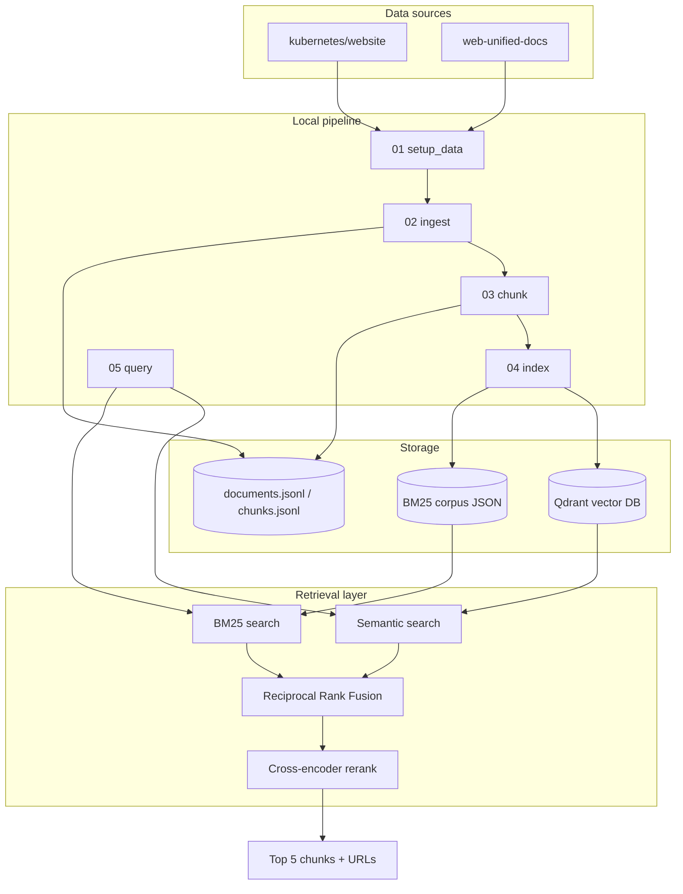
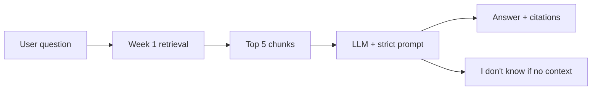

# Architecture

## End-to-end flow (Week 1)



## Week 2 addition (planned)



## Module map

```
src/
├── config.py              # settings.yaml loader
├── models.py              # Document, Chunk, SearchHit
├── ingest/
│   ├── setup.py           # git sparse clone
│   └── parser.py          # Markdown/MDX → JSONL
├── chunking/
│   └── splitter.py        # header-aware chunks
├── indexing/
│   ├── embedder.py        # sentence-transformers
│   ├── vector_store.py    # Qdrant client
│   └── keyword_index.py   # BM25
└── retrieval/
    ├── fusion.py          # RRF
    ├── reranker.py        # cross-encoder
    └── pipeline.py        # Retriever + run_indexing
```

## Configuration

All tunables live in `config/settings.yaml`:

| Section | Controls |
|---------|----------|
| `paths` | File locations for data |
| `doc_sources` | Git repos, globs, URL bases |
| `chunking` | Word targets, overlap |
| `embeddings` | Model name, batch size |
| `reranker` | Model, top-k before/after rerank |
| `qdrant` | Host, port, collection name |
| `retrieval` | Semantic/keyword top-k, RRF k |

## Infrastructure (local)

| Service | Image | Port |
|---------|-------|------|
| Qdrant | `qdrant/qdrant:v1.13.2` | 6333 |

Start: `docker compose up -d`
