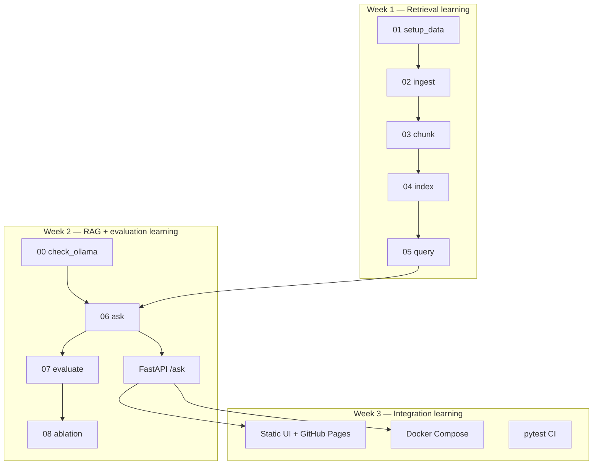

# DevOps Knowledge Copilot — Project Documentation

> **Purpose:** This repository documents a **learning project**. Every script, experiment, and design choice was made to understand how Retrieval-Augmented Generation (RAG) systems work in practice — not to ship a product to a client.

**Author:** gvarun20  
**Stack:** Python · FastAPI · Qdrant · BM25 · Ollama · RAGAS · Docker · GitHub Pages  
**Cost:** $0 — all experimentation runs locally

---

## Table of contents

1. [Problem statement](#1-problem-statement)
2. [Why this project matters (learning goals)](#2-why-this-project-matters-learning-goals)
3. [Project planning and workflow](#3-project-planning-and-workflow)
4. [High-level architecture](#4-high-level-architecture)
5. [What we explored (scope and extent)](#5-what-we-explored-scope-and-extent)
6. [Hurdles faced and how we solved them](#6-hurdles-faced-and-how-we-solved-them)
7. [Scripts reference](#7-scripts-reference)
8. [Source code map](#8-source-code-map)
9. [Evaluation experiments](#9-evaluation-experiments)
10. [What we deliberately did not build](#10-what-we-deliberately-did-not-build)
11. [Related documents](#11-related-documents)

---

## 1. Problem statement

### The real-world problem

DevOps and platform engineers constantly switch between **Terraform** and **Kubernetes** documentation while designing infrastructure, debugging deployments, and onboarding teammates. Official docs are authoritative but enormous — thousands of pages, version-specific syntax, and search that only matches keywords.

Generic chatbots make this worse: they answer confidently from memory, often with **outdated or wrong** HCL/YAML. A wrong `lifecycle` block or a misconfigured `Deployment` spec can break production.

### What we set out to learn

> Can we build a system that answers natural-language questions **only from official documentation**, with **source citations**, and **measure** whether retrieval and generation actually work?

### Learning constraints we chose

| Constraint | Reason |
|------------|--------|
| Official GitHub doc sources only | Legal, reproducible, version-controlled |
| Free local stack (Ollama, no paid APIs) | Learn without cloud bills |
| Numbered pipeline scripts | Understand each layer independently |
| RAGAS evaluation | Learn to measure quality, not guess |

---

## 2. Why this project matters (learning goals)

This project is **not** a commercial product. It is a structured way to learn concepts that appear in real AI engineering and DevOps roles.

### Concepts learned by building

| Concept | Where you learned it |
|---------|-------------------|
| Document ingestion at scale | Scripts 01–02 |
| Chunking strategies (header-aware vs fixed-size) | Script 03, [CHUNKING.md](CHUNKING.md) |
| Vector embeddings and vector databases | Script 04, Qdrant |
| Keyword search (BM25) | Script 04, `src/indexing/keyword_index.py` |
| Hybrid retrieval and rank fusion (RRF) | Script 05, `src/retrieval/fusion.py` |
| Cross-encoder reranking | Script 05, `src/retrieval/reranker.py` |
| Grounded LLM generation | Script 06, `src/generation/prompt.py` |
| RAG evaluation (RAGAS) | Scripts 07–08 |
| Ablation studies | Script 08 |
| REST API design | `src/api/` |
| Frontend/backend separation | `docs/index.html` + FastAPI |
| Docker for dependencies | `docker-compose.yml` |
| CI testing | `.github/workflows/ci.yml` |

### Why this helps in interviews

- You can explain **why** hybrid retrieval beat vector-only (with numbers: 0.41 → 0.89 relevancy)
- You can describe **tradeoffs** (local 3B model vs cloud LLM, chunk size, reranker cost)
- You can show **honest limitations** (small eval set, RAGAS failures on small models)
- You built something **end-to-end**, not just a Jupyter notebook

---

## 3. Project planning and workflow

The project was planned in **three learning phases**. Each phase added one layer without skipping ahead.

### Phase overview

```
Week 1 — RETRIEVAL     "Can we find the right doc sections?"
Week 2 — GENERATION    "Can an LLM answer from those sections only?"
Week 3 — INTEGRATION   "Can we expose it as API + UI + CI?"
```

### Complete workflow diagram



### Week-by-week plan and outcomes

| Week | Learning goal | Milestone | Status |
|------|---------------|-----------|--------|
| **1** | Understand retrieval pipeline | Question → 5 ranked doc chunks with URLs | ✅ Done |
| **2** | Add generation + measurement | Cited answers + RAGAS scores + ablation | ✅ Done |
| **3** | Package for demo and portfolio | FastAPI + UI + Docker + CI + GitHub Pages | ✅ Done |

### Daily learning rhythm (how to use the scripts)

Run scripts **in order** the first time. Each script teaches one concept before the next layer depends on it.

```powershell
# Phase 1 — build the index (once, ~30 min)
python scripts/01_setup_data.py
python scripts/02_ingest.py
python scripts/03_chunk.py
python scripts/04_index.py

# Phase 1 — test retrieval only (no LLM)
python scripts/05_query.py -i

# Phase 2 — full RAG
python scripts/00_check_ollama.py
python scripts/06_ask.py -i

# Phase 2 — measure quality
python scripts/07_evaluate.py --limit 5 --metrics local
python scripts/08_ablation.py --limit 3 --metrics local

# Phase 3 — API and UI
uvicorn src.api.main:app --reload
.\scripts\dev.ps1 ui-local
```

Step-by-step guide → [LEARNING_PATH.md](LEARNING_PATH.md)  
First-time setup → [GETTING_STARTED.md](GETTING_STARTED.md)

---

## 4. High-level architecture

### System layers

```
┌─────────────────────────────────────────────────────────────┐
│  USER                                                        │
│  Browser (GitHub Pages / localhost) or CLI (06_ask.py)      │
└──────────────────────────┬──────────────────────────────────┘
                           │ HTTP POST /ask
                           ▼
┌─────────────────────────────────────────────────────────────┐
│  API LAYER — FastAPI (src/api/)                              │
│  Orchestrates RAG pipeline, returns answer + citations       │
└──────────────────────────┬──────────────────────────────────┘
                           │
                           ▼
┌─────────────────────────────────────────────────────────────┐
│  RAG PIPELINE (src/rag/pipeline.py)                          │
│  ┌──────────────┐    ┌──────────────┐    ┌──────────────┐   │
│  │  RETRIEVAL   │ →  │   PROMPT     │ →  │  GENERATION  │   │
│  │  hybrid+rank │    │  strict rules│    │  Ollama LLM  │   │
│  └──────────────┘    └──────────────┘    └──────────────┘   │
└───────────┬─────────────────────────────┬───────────────────┘
            │                             │
            ▼                             ▼
┌───────────────────────┐       ┌─────────────────────────────┐
│  Qdrant (vectors)     │       │  Ollama (local LLM)         │
│  BM25 (keyword index) │       │  llama3.2:3b                │
└───────────────────────┘       └─────────────────────────────┘
```

### Data pipeline (offline — scripts 01–04)

```
kubernetes/website  ──┐
                      ├──► parse ──► chunk ──► embed ──► Qdrant
web-unified-docs   ───┘                              └──► BM25 JSON
     (Terraform)
```

### Retrieval pipeline (online — every question)

```
Question
   ├──► Embed query ──► Qdrant top-20 (semantic)
   └──► Tokenize ──► BM25 top-20 (keyword)
              │
              ▼
         RRF fusion (k=60)
              │
              ▼
         Cross-encoder rerank (top-20 → top-5)
              │
              ▼
         Top 5 chunks → prompt → LLM → answer + citations
```

### Ablation modes (experimentation)

We built three retrieval modes to **learn** which components matter:

| Mode | Semantic | BM25 | RRF | Reranker | Purpose |
|------|----------|------|-----|----------|---------|
| `semantic_only` | ✅ | ❌ | ❌ | ❌ | Baseline — vector search alone |
| `hybrid_no_rerank` | ✅ | ✅ | ✅ | ❌ | Test hybrid without reranker cost |
| `full` | ✅ | ✅ | ✅ | ✅ | Complete pipeline |

Full technical detail → [ARCHITECTURE.md](ARCHITECTURE.md)

---

## 5. What we explored (scope and extent)

### Data explored

| Source | Format | Documents | Chunks |
|--------|--------|-----------|--------|
| kubernetes/website | Markdown | ~1,333 | — |
| hashicorp/web-unified-docs (Terraform v1.9.x) | MDX | ~318 | — |
| **Total** | | **~1,651** | **~10,961** |

### Retrieval techniques explored

- [x] Sentence-transformer embeddings (`all-MiniLM-L6-v2`)
- [x] Qdrant vector storage (Docker)
- [x] BM25 keyword index (local JSON)
- [x] Reciprocal Rank Fusion (RRF)
- [x] Cross-encoder reranking (`ms-marco-MiniLM-L-6-v2`)
- [x] Ablation across three retrieval modes

### Generation techniques explored

- [x] Strict system prompt (answer only from context)
- [x] Citation format (title, section, URL)
- [x] "I don't know" refusal when context is insufficient
- [x] Ollama local LLM (`llama3.2:3b`)
- [x] Configurable OpenAI path (not used — kept for learning)

### Evaluation explored

- [x] RAGAS framework integration
- [x] 38-question held-out eval set (`evaluation/questions.jsonl`)
- [x] Metrics: `answer_relevancy`, `context_recall` (reliable on local 3B)
- [x] Attempted full 4-metric RAGAS (failed on small model — documented)
- [x] Ablation study with saved JSON results

### Integration explored

- [x] FastAPI REST API (`GET /health`, `POST /ask`)
- [x] Static HTML chat UI
- [x] GitHub Pages portfolio site
- [x] Docker Compose (Qdrant + optional API/UI)
- [x] pytest unit tests + GitHub Actions CI
- [x] Streamlit UI (optional experiment — not primary path)

### What we measured (results)

| Experiment | Result | Learning |
|------------|--------|----------|
| Baseline (5 Q, full pipeline) | answer_relevancy **0.70**, context_recall **0.47** | System works; retrieval is main lever |
| Ablation: semantic_only | relevancy **0.41** | Vector-only is weak alone |
| Ablation: hybrid_no_rerank | relevancy **0.89** | BM25 + RRF is the biggest win |
| Ablation: full | relevancy **0.63** | Reranker needs larger eval to confirm |

Details → [EVAL_RESULTS.md](EVAL_RESULTS.md)

---

## 6. Hurdles faced and how we solved them

Honest record of problems encountered during learning — useful for interviews ("tell me about a technical challenge").

### Data and ingestion

| Hurdle | What happened | Solution learned |
|--------|---------------|------------------|
| **Terraform repo moved** | Original `hashicorp/terraform-website` was empty; docs moved to `web-unified-docs` | Always verify doc sources; adapt parser to new repo structure |
| **MDX not Markdown** | Terraform docs use `.mdx` with JSX components | Extended parser to handle MDX; strip non-content tags |
| **Huge repos** | Full clone would be gigabytes | Sparse Git checkout — clone only doc folders needed |

### Indexing and retrieval

| Hurdle | What happened | Solution learned |
|--------|---------------|------------------|
| **Qdrant API change** | `search()` method deprecated in newer qdrant-client | Updated to `query_points()` API |
| **Docker volume reset** | Renaming compose project wiped Qdrant data | Re-ran `04_index.py`; document that index lives in Docker volume |
| **First index slow (~15 min)** | Embedding 10k+ chunks + model download | Normal for local CPU; batch embedding in config |
| **Chunk quality** | Fixed-size splits broke code blocks mid-syntax | Switched to header-aware chunking — see [CHUNKING.md](CHUNKING.md) |

### Generation and LLM

| Hurdle | What happened | Solution learned |
|--------|---------------|------------------|
| **Ollama not running** | API errors when Ollama app closed | Added `00_check_ollama.py`; document system tray requirement |
| **Slow first answer (1–2 min)** | Model load + retrieval + generation on laptop CPU | Expected for 3B local model; use interactive mode after first query |
| **Hallucinated URLs** | Early prompts let LLM invent links | Strict prompt: cite only retrieved chunks |

### Evaluation (RAGAS)

| Hurdle | What happened | Solution learned |
|--------|---------------|------------------|
| **Missing packages** | `langchain_ollama`, `langchain_huggingface` not installed | Added to `requirements.txt` |
| **Import path changes** | RAGAS/langchain moved modules between versions | Created `src/evaluation/ragas_compat.py` shim |
| **JSON parse failures** | Ollama 3B can't reliably output RAGAS JSON for all metrics | Created `--metrics local` preset (2 reliable metrics) |
| **Timeouts** | `faithfulness` and `context_precision` timed out on 3B | Increased timeout to 900s; documented limitation |
| **Event loop closed** | Running RAGAS metrics in a loop broke asyncio | Single `evaluate()` call for all metrics |
| **`dataset` NameError** | Accidental line removal in `ragas_runner.py` | Restored; added tests |

### UI and deployment

| Hurdle | What happened | Solution learned |
|--------|---------------|------------------|
| **GitHub Pages HTTPS** | Browser blocks HTTPS page calling `http://localhost` API | Portfolio site shows static demo; live chat runs locally |
| **Streamlit confusion** | Refresh vs API restart unclear | Moved to static HTML UI; Streamlit kept as optional experiment |
| **CORS errors** | Browser UI blocked API calls | Added CORS middleware to FastAPI |

### Harmless noise (ignored)

- `ResourceTracker` error on Python exit — dependency shutdown noise; answers still valid
- HuggingFace Hub warnings — optional `HF_TOKEN` for faster downloads

---

## 7. Scripts reference

All scripts live in `scripts/`. They are numbered to enforce **learning order** — each builds on the previous step.

### Phase 0 — Prerequisites

| Script | Purpose | Why it exists |
|--------|---------|---------------|
| **`00_check_ollama.py`** | Verify Ollama is running and model is pulled | Catches the most common setup mistake before waiting minutes for a failed RAG call |

```powershell
python scripts/00_check_ollama.py
```

---

### Phase 1 — Data pipeline (Week 1 learning)

| Script | Purpose | Input → Output | Key concept learned |
|--------|---------|----------------|---------------------|
| **`01_setup_data.py`** | Clone official doc repos with sparse checkout | GitHub → `data/raw/` | Working with large repos efficiently |
| **`02_ingest.py`** | Parse Markdown/MDX into unified JSONL | `data/raw/` → `data/processed/documents.jsonl` | Normalizing heterogeneous doc formats |
| **`03_chunk.py`** | Split documents into retrieval-sized chunks | documents.jsonl → `data/chunks/chunks.jsonl` | Header-aware chunking vs naive splits |
| **`04_index.py`** | Embed chunks, upsert to Qdrant, build BM25 | chunks.jsonl → Qdrant + `data/index/bm25_corpus.json` | Vector DB + keyword index together |
| **`05_query.py`** | Test retrieval interactively (no LLM) | Question → top-5 chunks | Hybrid search, RRF, reranking in isolation |

```powershell
# Run in order (first time)
python scripts/01_setup_data.py
python scripts/02_ingest.py
python scripts/03_chunk.py
python scripts/04_index.py

# Test retrieval
python scripts/05_query.py "How do I create a Kubernetes Deployment?"
python scripts/05_query.py -i   # interactive mode
python scripts/05_query.py --mode semantic_only   # ablation mode
```

**Week 1 milestone:** You can find relevant doc sections without any LLM.

---

### Phase 2 — RAG and evaluation (Week 2 learning)

| Script | Purpose | Key concept learned |
|--------|---------|---------------------|
| **`06_ask.py`** | Full RAG: retrieve → prompt → generate cited answer | End-to-end grounded generation |
| **`07_evaluate.py`** | Run RAGAS metrics on eval question set | Measuring RAG quality with numbers |
| **`08_ablation.py`** | Compare retrieval modes side-by-side | Experimental methodology / ablation studies |

```powershell
python scripts/06_ask.py "What is a Terraform remote backend?"
python scripts/06_ask.py -i

python scripts/07_evaluate.py --limit 5 --metrics local
python scripts/08_ablation.py --limit 3 --metrics local
```

**Week 2 milestone:** You can answer questions with citations and prove retrieval choices with metrics.

---

### Phase 3 — UI and helpers (Week 3 learning)

| Script | Purpose | Key concept learned |
|--------|---------|---------------------|
| **`09_ui.py`** | Launch optional Streamlit UI (experiments only) | Why teams separate UI from API |
| **`dev.ps1`** | Windows helper for common commands | Dev workflow automation |

```powershell
.\scripts\dev.ps1 demo       # Start Qdrant + show demo steps
.\scripts\dev.ps1 api        # FastAPI with hot reload
.\scripts\dev.ps1 ui-local   # Static UI at localhost:8080
.\scripts\dev.ps1 test       # Run pytest (same as CI)
```

**Week 3 milestone:** You can demo the system in a browser or API client.

---

### Script dependency graph

```
00_check_ollama.py          (optional pre-flight)
        │
01_setup_data.py
        │
02_ingest.py
        │
03_chunk.py
        │
04_index.py ──────────────────────────┐
        │                             │
05_query.py (retrieval test)          │
                                      │
06_ask.py (full RAG) ◄────────────────┘
        │
        ├── 07_evaluate.py
        └── 08_ablation.py

09_ui.py / dev.ps1          (optional wrappers)
uvicorn src.api.main:app    (API server — not a script file)
```

---

## 8. Source code map

Scripts are entry points; logic lives in `src/`:

| Module | Responsibility |
|--------|---------------|
| `src/config.py` | Load `config/settings.yaml` + env overrides |
| `src/models.py` | Shared data types (Document, Chunk, Citation) |
| `src/ingest/` | Git clone + Markdown/MDX parsing |
| `src/chunking/` | Header-aware text splitting |
| `src/indexing/` | Embeddings, Qdrant client, BM25 builder |
| `src/retrieval/` | Search pipeline, RRF, reranker, ablation modes |
| `src/generation/` | Prompt template, LLM client, answer formatting |
| `src/rag/` | End-to-end RAG orchestration |
| `src/api/` | FastAPI routes and schemas |
| `src/evaluation/` | RAGAS runner + eval data loader |

Configuration: `config/settings.yaml`  
Eval questions: `evaluation/questions.jsonl`  
Eval results: `evaluation/results/*.json`

---

## 9. Evaluation experiments

All experiments were run to **learn how to measure RAG systems**, not to claim production readiness.

| Experiment | Command | What we learned |
|------------|---------|-----------------|
| Smoke test (1 Q) | `07_evaluate.py --limit 1 --metrics local` | Pipeline works end-to-end |
| Baseline (5 Q) | `07_evaluate.py --limit 5 --metrics local` | Relevancy ~0.70 on small sample |
| Ablation (3 Q × 3 modes) | `08_ablation.py --limit 3 --metrics local` | Hybrid beats semantic-only dramatically |
| Full 4-metric RAGAS | `07_evaluate.py --metrics full` | Ollama 3B too weak for JSON-heavy metrics |

Full results → [EVAL_RESULTS.md](EVAL_RESULTS.md)

---

## 10. What we deliberately did not build

To keep focus on **learning core RAG concepts** without scope creep:

| Skipped | Why |
|---------|-----|
| Cloud-hosted live API | Free tier unreliable; local demo sufficient for learning |
| Paid OpenAI API | Chose Ollama to learn without cost |
| User authentication | Not relevant to RAG learning goals |
| Multi-user database | Single-user local project |
| Kubernetes deployment of the app itself | Out of scope for a learning project |
| Fine-tuning / custom models | Retrieval quality was the learning focus |
| Production monitoring (Prometheus) | Documented as future learning path |

---

## 11. Related documents

| Document | Contents |
|----------|----------|
| [LEARNING_PATH.md](LEARNING_PATH.md) | Week-by-week script order and concepts |
| [GETTING_STARTED.md](GETTING_STARTED.md) | First-time setup walkthrough |
| [ARCHITECTURE.md](ARCHITECTURE.md) | Technical architecture diagrams |
| [CHUNKING.md](CHUNKING.md) | Chunking design deep-dive |
| [EVAL_RESULTS.md](EVAL_RESULTS.md) | All RAGAS scores and ablation tables |
| [PORTFOLIO.md](PORTFOLIO.md) | Resume bullets and interview demo script |
| [HOSTING.md](HOSTING.md) | GitHub Pages setup |
| [FREE_SETUP.md](FREE_SETUP.md) | Ollama installation guide |
| [WEEK1_SUMMARY.md](WEEK1_SUMMARY.md) | Week 1 achievements |
| [WEEK2_PLAN.md](WEEK2_PLAN.md) | Week 2 checklist |

---

*This project was built to learn. The code, experiments, and documentation reflect that purpose.*
